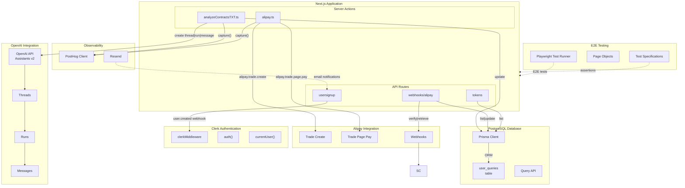
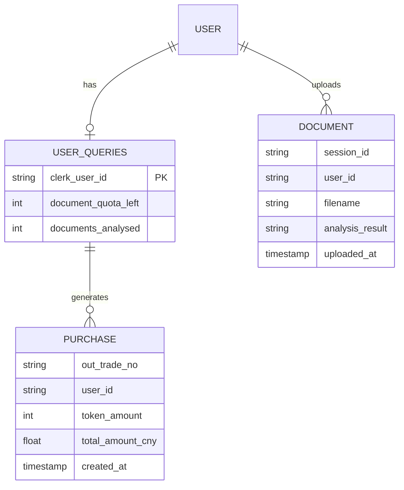
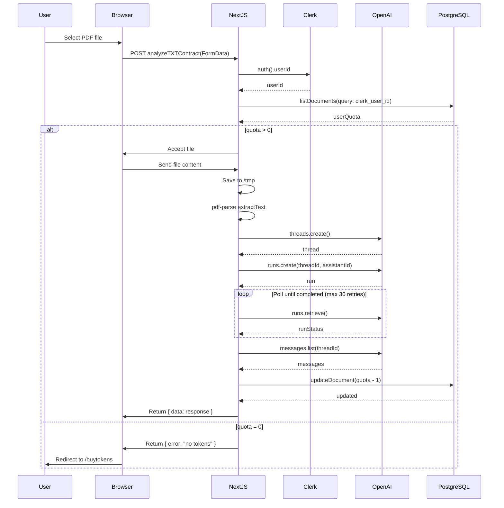

# Component Interactions - System Integration Diagrams

> LegalEdge AI Contract Analysis SaaS Platform

## Overview

This document shows how components connect to each other and to external services using C4-style component diagrams.

---

## Frontend to Backend Connections

```mermaid
graph LR
    subgraph Browser["Browser / Client"]
        SPA["Next.js SPA<br/>(React Components)"]
        Auth["Clerk Auth<br/>(useAuth, useUser)"]
        State["TokenContext<br/>(useToken)"]
    end

    subgraph ServerActions["Server Actions Layer"]
        Analyze["analyzeTXTContract()<br/>analyzeContractsTXT.ts"]
        AlipayAction["createAlipayOrder()<br/>alipay.ts"]
        AlipayIntent["createPaymentIntent()<br/>alipay.ts"]
    end

    subgraph APIRoutes["API Routes Layer"]
        AlipayWebhook["POST /api/webhooks/alipay<br/>route.ts"]
        UserSignup["POST /api/usersignup<br/>route.ts"]
        TokenAPI["GET /api/tokens<br/>route.ts"]
    end

    subgraph External["External Services"]
        OpenAI_API["OpenAI API"]
        Alipay_API["Alipay API"]
        Clerk_API["Clerk Auth API"]
        PostgreSQL_DB["PostgreSQL Database"]
        PostHog_AN["PostHog Analytics"]
        Resend_Mail["Resend Email"]
    end

    SPA -->|"formData"| Analyze
    SPA -->|"FormData"| AlipayAction
    SPA -->|"FormData"| AlipayIntent

    Auth -->|"userId"| Analyze
    Auth -->|"userId"| AlipayAction

    State -->|"quota update"| SPA

    Analyze -->|"thread.run|message"| OpenAI_API
    Analyze -->|"update quota"| PostgreSQL_DB
    Analyze -->|"event", "event"| PostHog_AN

    AlipayAction -->|"checkout.session"| Alipay_API
    AlipayAction -->|"event"| PostHog_AN

    AlipayWebhook -->|"webhook verification"| Alipay_API
    AlipayWebhook -->|"read session"| Alipay_API
    AlipayWebhook -->|"update quota"| PostgreSQL_DB
    AlipayWebhook -->|"purchase event"| PostHog_AN

    TokenAPI -->|"query quota"| PostgreSQL_DB

    UserSignup -->|"webhook"| Clerk_API
    UserSignup -->|"create document"| PostgreSQL_DB
```

### Server Action Details

| Action | File | External Calls | Return Type |
|--------|------|----------------|-------------|
| `analyzeTXTContract(formData)` | `analyzeContractsTXT.ts` | OpenAI threads, PostgreSQL update | `{ data: Message, error: string \| null }` |
| `createAlipayOrder(formData)` | `alipay.ts` | Alipay trade create | `{ trade_no: string \| null, payment_url: string \| null }` |
| `createPaymentIntent(formData)` | `alipay.ts` | Alipay trade page pay | `{ trade_no: string }` |

---

## External Service Integrations



### Integration Authentication Methods

| Service | Authentication Method | Environment Variable |
|---------|---------------------|---------------------|
| **OpenAI** | API Key | `OPENAI_API_KEY` |
| **OpenAI Assistant** | Assistant ID | `OPENAI_ASSISTANT_ID`, `OPENAI_PREMIUM_ASSISTANT_ID` |
| **Alipay** | App ID + Private Key + Public Key | `ALIPAY_APP_ID`, `ALIPAY_PRIVATE_KEY`, `ALIPAY_ALIPAY_PUBLIC_KEY` |
| **Clerk** | Publishable Key + Secret | `NEXT_PUBLIC_CLERK_PUBLISHABLE_KEY`, `CLERK_SECRET_KEY` |
| **PostgreSQL (Prisma)** | Connection String | `DATABASE_URL` |
| **PostHog** | Project API Key | `NEXT_PUBLIC_POSTHOG_KEY`, `NEXT_PUBLIC_POSTHOG_HOST` |
| **Resend** | API Key | `RESEND_API_KEY` |

---

## Data Model Relationships



---

## Request-Response Flow for Contract Analysis



---

## Token Purchase Sequence

```mermaid
sequenceDiagram
    participant User
    participant Browser
    participant NextJS
    participant Alipay
    participant Clerk
    participant PostgreSQL

    User->>Browser: Click Purchase
    Browser->>NextJS: createAlipayOrder(formData)
    NextJS->>Clerk: auth().userId
    Clerk-->>NextJS: userId

    NextJS->>Alipay: alipay.trade.create({
        out_trade_no, total_amount, subject
    })
    Alipay-->>NextJS: trade { trade_no, qr_code }

    NextJS-->>Browser: { qr_code }

    Browser->>Alipay: Display QR code / Redirect to WAP
    User->>Alipay: Complete payment
    Alipay->>Browser: Redirect to /buytokens/success

    Note over Browser,Alipay: Meanwhile, webhook fires
    Alipay->>NextJS: POST /api/webhooks/alipay
    NextJS->>Alipay: Verify signature
    NextJS->>Alipay: Get trade status
    Alipay-->>NextJS: trade details

    NextJS->>PostgreSQL: Find user by out_trade_no
    PostgreSQL-->>NextJS: userRecord

    NextJS->>PostgreSQL: Update document_quota_left += tokens
    PostgreSQL-->>NextJS: updatedRecord
```

---

## Component Dependencies


### Dependency Summary

| Component | Dependencies |
|-----------|-------------|
| `ContractUploader.tsx` | `TokenContext.tsx`, `analyzeContractsTXT.ts` (server action) |
| `MarkdownRenderer.tsx` | `TokenContext.tsx` |
| `TokenContext.tsx` | PostgreSQL (via `/api/tokens`) |
| `proxy.ts` (middleware) | Clerk API |
| `analyzeContractsTXT.ts` | Clerk (auth), PostgreSQL, OpenAI, PostHog |
| `alipay.ts` | Clerk (auth), Alipay, PostHog |
| `webhooks/alipay/route.ts` | Alipay (webhook verification), PostgreSQL, PostHog |
| **E2E Tests** | Playwright, Page Objects, Next.js app (baseURL) |

---

## Middleware Flow

```mermaid
flowchart TD
    A["Request to protected route"] --> B{"Clerk Middleware<br/>proxy.ts"}
    B -->|Clerk Auth| C{("userId exists?")}
    C -->|Yes| D["Allow request"]
    C -->|No| E{("Protected route?")}
    E -->|Yes| F["redirectToSignIn()"]
    E -->|No| D
    F --> G["Clerk Sign-In Page"]
    G --> H["User authenticates"]
    H -->|Success| I["Redirect to original route"]
    I --> D
```

---

*Document generated for LegalEdge AI technical architecture*