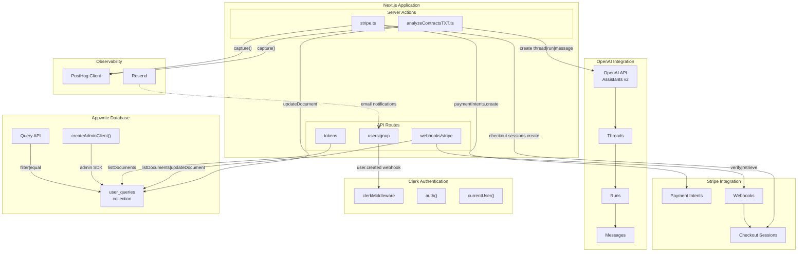
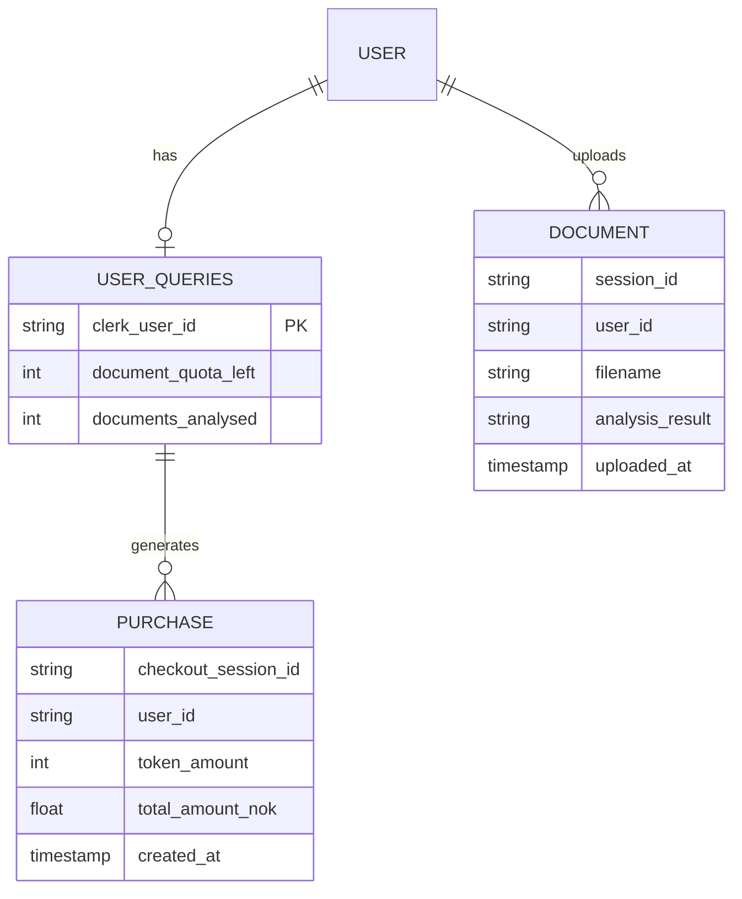
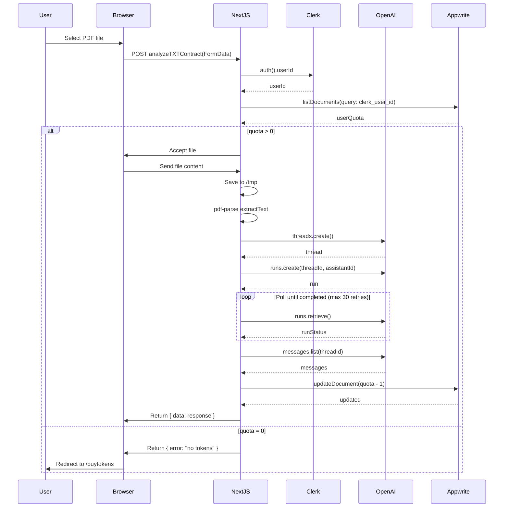
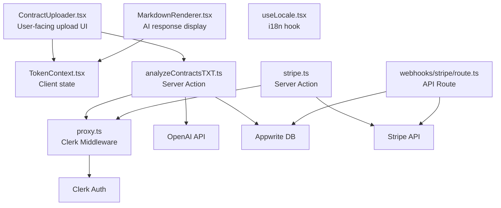

# Component Interactions - System Integration Diagrams

> LegalEdge AI Contract Analysis SaaS Platform

## Overview

This document shows how components connect to each other and to external services using C4-style component diagrams.

---

## Frontend to Backend Connections

```mermaid
graph LR
    subgraph Browser["Browser / Client"]
        SPA["Next.js SPA<br/>(React Components)"]
        Auth["Clerk Auth<br/>(useAuth, useUser)"]
        State["TokenContext<br/>(useToken)"]
    end

    subgraph ServerActions["Server Actions Layer"]
        Analyze["analyzeTXTContract()<br/>analyzeContractsTXT.ts"]
        StripeAction["createCheckoutSession()<br/>stripe.ts"]
        StripeIntent["createPaymentIntent()<br/>stripe.ts"]
    end

    subgraph APIRoutes["API Routes Layer"]
        StripeWebhook["POST /api/webhooks/stripe<br/>route.ts"]
        UserSignup["POST /api/usersignup<br/>route.ts"]
        TokenAPI["GET /api/tokens<br/>route.ts"]
    end

    subgraph External["External Services"]
        OpenAI_API["OpenAI API"]
        Stripe_API["Stripe API"]
        Clerk_API["Clerk Auth API"]
        Appwrite_DB["Appwrite Database"]
        PostHog_AN["PostHog Analytics"]
        Resend_Mail["Resend Email"]
    end

    SPA -->|"formData"| Analyze
    SPA -->|"FormData"| StripeAction
    SPA -->|"FormData"| StripeIntent

    Auth -->|"userId"| Analyze
    Auth -->|"userId"| StripeAction

    State -->|"quota update"| SPA

    Analyze -->|"thread.run|message"| OpenAI_API
    Analyze -->|"update quota"| Appwrite_DB
    Analyze -->|"event", "event"| PostHog_AN

    StripeAction -->|"checkout.session"| Stripe_API
    StripeAction -->|"event"| PostHog_AN

    StripeWebhook -->|"webhook verification"| Stripe_API
    StripeWebhook -->|"read session"| Stripe_API
    StripeWebhook -->|"update quota"| Appwrite_DB
    StripeWebhook -->|"purchase event"| PostHog_AN

    TokenAPI -->|"query quota"| Appwrite_DB

    UserSignup -->|"webhook"| Clerk_API
    UserSignup -->|"create document"| Appwrite_DB
```

### Server Action Details

| Action | File | External Calls | Return Type |
|--------|------|----------------|-------------|
| `analyzeTXTContract(formData)` | `analyzeContractsTXT.ts` | OpenAI threads, Appwrite update | `{ data: Message, error: string \| null }` |
| `createCheckoutSession(formData)` | `stripe.ts` | Stripe checkout.sessions.create | `{ client_secret: string \| null, url: string \| null }` |
| `createPaymentIntent(formData)` | `stripe.ts` | Stripe paymentIntents.create | `{ client_secret: string }` |

---

## External Service Integrations



### Integration Authentication Methods

| Service | Authentication Method | Environment Variable |
|---------|---------------------|---------------------|
| **OpenAI** | API Key | `OPENAI_API_KEY` |
| **OpenAI Assistant** | Assistant ID | `OPENAI_ASSISTANT_ID`, `OPENAI_PREMIUM_ASSISTANT_ID` |
| **Stripe** | API Key + Webhook Secret | `STRIPE_SECRET_KEY`, `STRIPE_WEBHOOK_SECRET` |
| **Clerk** | Publishable Key + Secret | `NEXT_PUBLIC_CLERK_PUBLISHABLE_KEY`, `CLERK_SECRET_KEY` |
| **Appwrite** | Endpoint + Project ID + Secret | `NEXT_PUBLIC_APPWRITE_*`, `APPWRITE_SECRET_KEY` |
| **PostHog** | Project API Key | `NEXT_PUBLIC_POSTHOG_KEY`, `NEXT_PUBLIC_POSTHOG_HOST` |
| **Resend** | API Key | `RESEND_API_KEY` |

---

## Data Model Relationships



---

## Request-Response Flow for Contract Analysis



---

## Token Purchase Sequence

```mermaid
sequenceDiagram
    participant User
    participant Browser
    participant NextJS
    participant Stripe
    participant Clerk
    participant Appwrite

    User->>Browser: Click Purchase
    Browser->>NextJS: createCheckoutSession(formData)
    NextJS->>Clerk: auth().userId
    Clerk-->>NextJS: userId

    NextJS->>Stripe: checkout.sessions.create({
        line_items, client_reference_id: userId
    })
    Stripe-->>NextJS: session { id, url }

    NextJS-->>Browser: { url }

    Browser->>Stripe: Redirect to session.url
    User->>Stripe: Complete payment
    Stripe->>Browser: Redirect to /buytokens/success

    Note over Browser,Stripe: Meanwhile, webhook fires
    Stripe->>NextJS: POST /api/webhooks/stripe
    NextJS->>Stripe: Verify signature
    NextJS->>Stripe: Retrieve session
    Stripe-->>NextJS: session details

    NextJS->>Appwrite: Find user by client_reference_id
    Appwrite-->>NextJS: userDoc

    NextJS->>Appwrite: Update document_quota_left += tokens
    Appwrite-->>NextJS: updatedDoc
```

---

## Component Dependencies



### Dependency Summary

| Component | Dependencies |
|-----------|-------------|
| `ContractUploader.tsx` | `TokenContext.tsx`, `analyzeContractsTXT.ts` (server action) |
| `MarkdownRenderer.tsx` | `TokenContext.tsx` |
| `TokenContext.tsx` | Appwrite API (via `/api/tokens`) |
| `proxy.ts` (middleware) | Clerk API |
| `analyzeContractsTXT.ts` | Clerk (auth), Appwrite, OpenAI, PostHog |
| `stripe.ts` | Clerk (auth), Stripe, PostHog |
| `webhooks/stripe/route.ts` | Stripe (webhook verification), Appwrite, PostHog |

---

## Middleware Flow

```mermaid
flowchart TD
    A["Request to protected route"] --> B{"Clerk Middleware<br/>proxy.ts"}
    B -->|Clerk Auth| C{("userId exists?")}
    C -->|Yes| D["Allow request"]
    C -->|No| E{("Protected route?")}
    E -->|Yes| F["redirectToSignIn()"]
    E -->|No| D
    F --> G["Clerk Sign-In Page"]
    G --> H["User authenticates"]
    H -->|Success| I["Redirect to original route"]
    I --> D
```

---

*Document generated for LegalEdge AI technical architecture*