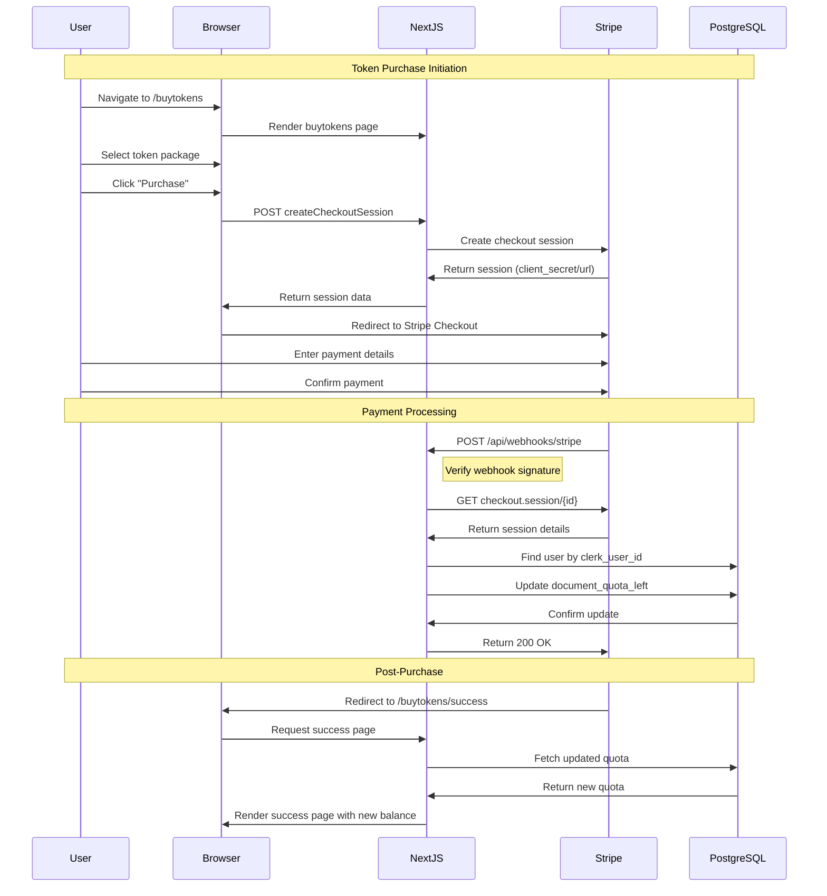
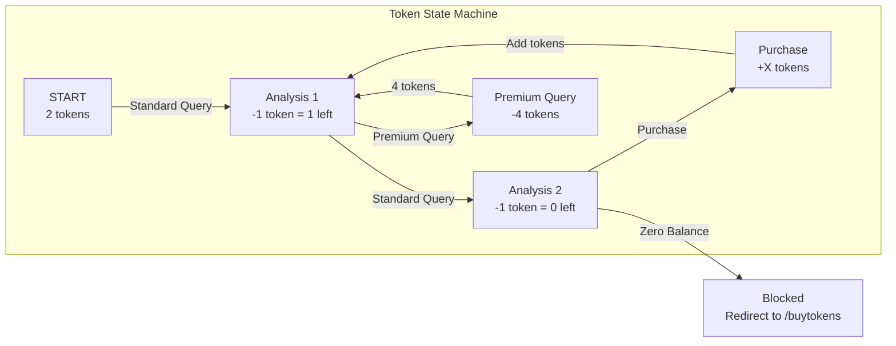
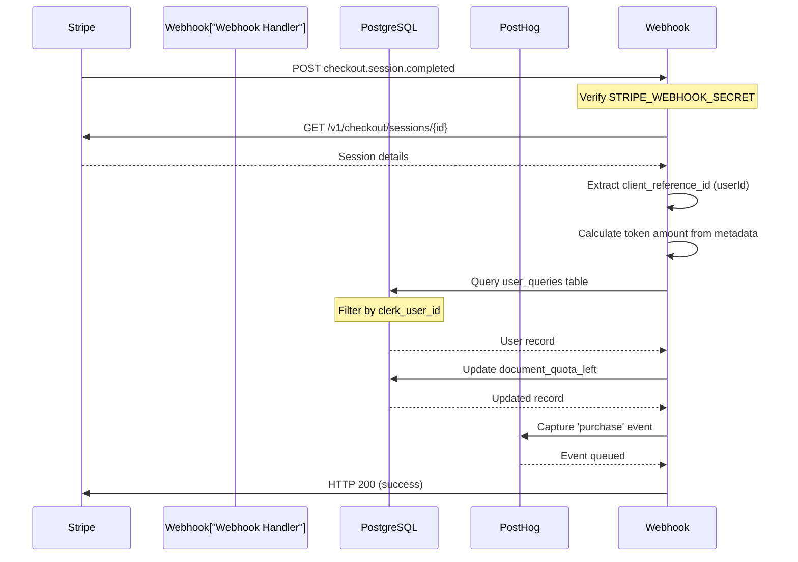

# Data Flow - Contract Analysis & Payment Pipelines

> LegalEdge AI Contract Analysis SaaS Platform

## Overview

This document visualizes the complete data flow for two critical business processes:
1. **Contract Analysis Flow** - From PDF upload to AI analysis result
2. **Payment Flow** - From token purchase to quota addition

---

## Contract Analysis Pipeline

```mermaid
flowchart TD
    subgraph Upload["1. User Upload Phase"]
        A[("User selects PDF file")]
        B[("ContractUploader validates")]
        C{("File valid?")}
        C -->|No| D["Return error message"]
        C -->|Yes| E["Save to /tmp"]
    end

    subgraph Extraction["2. Text Extraction Phase"]
        F["pdf-parse reads PDF"]
        G{("Extraction success?")}
        G -->|No| H["Return extraction error"]
        G -->|Yes| I["Return raw text"]
    end

    subgraph AI["3. OpenAI Analysis Phase"]
        J["Create OpenAI Thread"]
        K["Add user message with text"]
        L["Create Assistant Run"]
        M{("Run status?")]
        M -->|in_progress| N["Poll every 2s (exponential backoff)"]
        M -->|failed| O["Return analysis error"]
        M -->|completed| P["Retrieve assistant message"]
    end

    subgraph Update["4. Quota Update Phase"]
        Q["Update PostgreSQL record<br/>document_quota_left -= 1<br/>documents_analysed += 1"]
        R{("Update success?")}
        R -->|No| S["Return update error"]
        R -->|Yes| T["Track PostHog event"]
    end

    subgraph Result["5. Result Return Phase"]
        U["revalidatePath('/')"]
        V[("Return analysis result to UI")]
        W[("Display in MarkdownRenderer")]
    end

    A --> B --> C
    C --> D
    C --> E --> F --> G
    G --> H
    G --> I --> J --> K --> L --> M
    M --> N --> M
    M --> O
    M --> P --> Q --> R
    R --> S
    R --> T --> U --> V --> W
```

### Step-by-Step Contract Analysis Flow

| Phase | Step | Action | File |
|-------|------|--------|------|
| **Upload** | 1 | User selects PDF via `ContractUploader` component | `ContractUploader.tsx` |
| **Upload** | 2 | Client-side validation (type, size) | `ContractUploader.tsx` |
| **Upload** | 3 | FormData sent to `analyzeTXTContract` server action | `analyzeContractsTXT.ts:48` |
| **Validation** | 4 | Server re-validates file type/size | `analyzeContractsTXT.ts:79-91` |
| **Validation** | 5 | Check user quota in PostgreSQL | `analyzeContractsTXT.ts:57-71` |
| **Storage** | 6 | Save file to `/tmp/{uuid}-{filename}` | `analyzeContractsTXT.ts:95-97` |
| **Extraction** | 7 | `pdf-parse` extracts text from PDF | `analyzeContractsTXT.ts:99` |
| **AI** | 8 | Create OpenAI thread | `analyzeContractsTXT.ts:102-113` |
| **AI** | 9 | Create assistant run with `OPENAI_ASSISTANT_ID` | `analyzeContractsTXT.ts:118-120` |
| **AI** | 10 | Poll run status (max 30 retries, exponential backoff) | `analyzeContractsTXT.ts:130-143` |
| **AI** | 11 | Retrieve assistant response | `analyzeContractsTXT.ts:145-147` |
| **Update** | 12 | Decrement `document_quota_left` in PostgreSQL | `analyzeContractsTXT.ts:150-153` |
| **Analytics** | 13 | PostHog `Document Analyzed` event | `analyzeContractsTXT.ts:162-171` |
| **Cleanup** | 14 | Delete temp file from `/tmp` | `analyzeContractsTXT.ts:199-202` |
| **Result** | 15 | Return response to client, revalidate path | `analyzeContractsTXT.ts:173-175` |

### Error Handling Paths

| Error | Detection Point | User Message |
|-------|-----------------|--------------|
| No user session | `analyzeContractsTXT.ts:54-56` | "User ID is missing" |
| User quota not found | `analyzeContractsTXT.ts:66-68` | "User quota not found" |
| Zero tokens remaining | `analyzeContractsTXT.ts:69-71` | "Du er tom for tokens..." |
| Invalid file type | `analyzeContractsTXT.ts:80-82` | "Only PDF files are allowed" |
| File too large | `analyzeContractsTXT.ts:85-87` | "File size exceeds 5MB limit" |
| Empty file | `analyzeContractsTXT.ts:90-92` | "File is empty" |
| PDF extraction failed | `analyzeContractsTXT.ts:40-44` | "Could not read PDF file" |
| Analysis timeout | `analyzeContractsTXT.ts:131-133` | "Analysis timeout..." |
| OpenAI config error | `analyzeContractsTXT.ts:115-117` | "Server configuration error" |

---

## Payment Flow (Stripe Checkout)



### Payment Flow Steps

| Step | Action | File |
|------|--------|------|
| 1 | User selects token package on `/buytokens` page | `buytokens/page.tsx` |
| 2 | User submits purchase form | Server action `createCheckoutSession` |
| 3 | Server creates Stripe checkout session | `stripe.ts:24-51` |
| 4 | User redirected to Stripe Checkout | Stripe hosted page |
| 5 | User completes payment on Stripe | - |
| 6 | Stripe sends webhook to `/api/webhooks/stripe` | `route.ts` |
| 7 | Webhook verifies signature | `route.ts` |
| 8 | Webhook retrieves session details | Stripe API |
| 9 | Webhook updates user quota in PostgreSQL | `route.ts` |
| 10 | User redirected to success page | `/buytokens/success` |

### Discount Tiers

| Tier | Threshold (tokens) | Discount |
|------|-------------------|----------|
| LOW_VOLUME | 100+ | 5% |
| MEDIUM_VOLUME | 500+ | 10% |
| HIGH_VOLUME | 1000+ | 15% |

### Stripe Configuration Constants

```typescript
CURRENCY = 'nok'
MIN_AMOUNT = 10.0 NOK
MAX_AMOUNT = 500.0 NOK
AMOUNT_STEP = 2.0 NOK
TOKENS_PER_QUERY = 1
TOKENS_PER_PREMIUM_QUERY = 4
NOKPERTOKEN = 2
START_TOKENS = 2
```

---

## Token Consumption Flow



---

## Webhook Event Flow



---

## File References

| Flow | Key Files |
|------|-----------|
| Contract Analysis | `app/actions/analyzeContractsTXT.ts` |
| Payment Creation | `app/actions/stripe.ts` |
| Webhook Handler | `app/api/webhooks/stripe/route.ts` |
| Token API | `app/api/tokens/route.ts` |
| User Signup | `app/api/usersignup/route.ts` |

---

*Document generated for LegalEdge AI technical architecture*