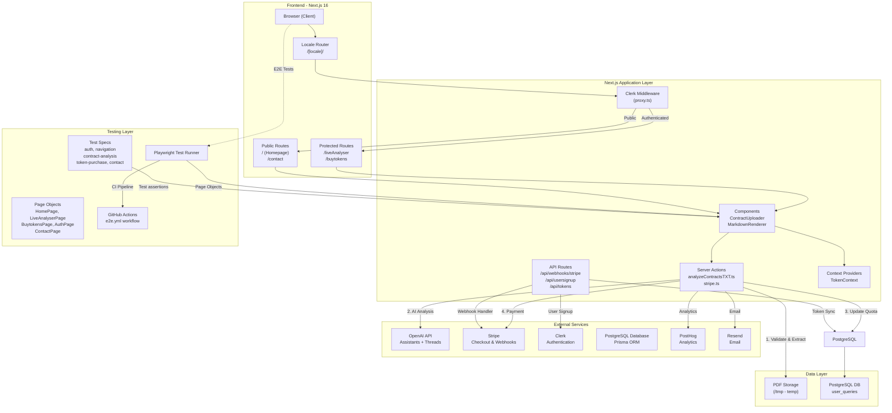
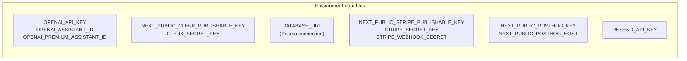
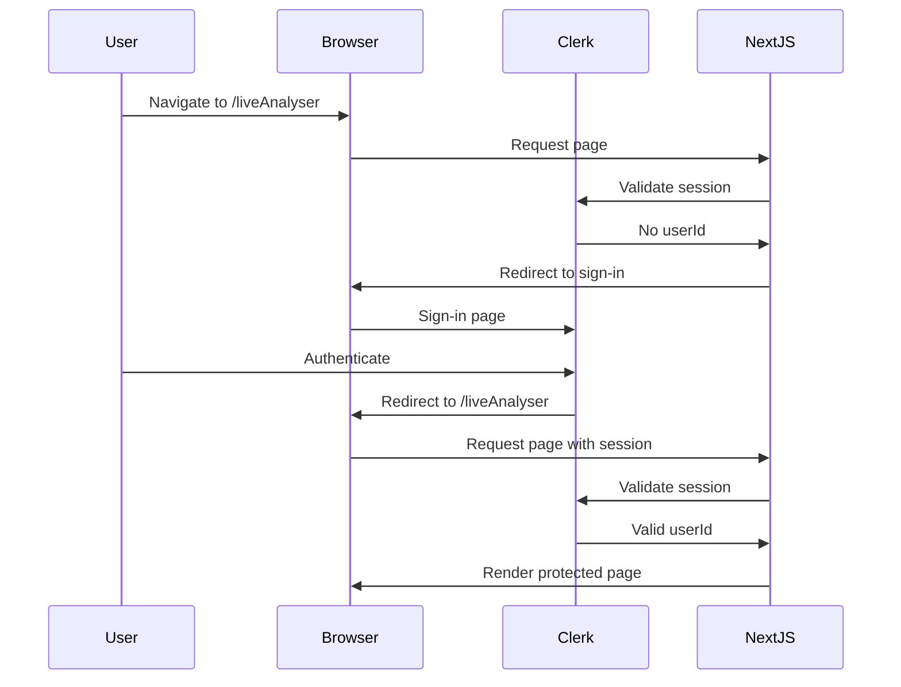

# System Overview - Technical Architecture Diagram

> LegalEdge AI Contract Analysis SaaS Platform

## Overview

This document provides a high-level system architecture diagram for LegalEdge AI, visualizing the complete system components, data flow, and external integrations.

**System Purpose:** AI-powered contract analysis platform using OpenAI's Assistants API with token-based payment system.

**Technology Stack:**
- **Frontend:** Next.js 16 with TypeScript, App Router, Turbopack
- **Backend:** Next.js Server Actions & API Routes
- **Authentication:** Clerk (clerkMiddleware)
- **Database:** PostgreSQL with Prisma ORM (user_queries table)
- **AI Processing:** OpenAI Assistants API (Threads & Runs)
- **Payments:** Stripe Checkout
- **Analytics:** PostHog
- **Email:** Resend
- **E2E Testing:** Playwright (Page Object Model pattern)

---

## System Architecture Diagram



---

## Component Description

### Frontend Components

| Component | Purpose |
|-----------|---------|
| **Browser** | End-user web browser |
| **Locale Router** | i18n routing handler (/en, /zh, /nb) |
| **Clerk Middleware** | Authentication & route protection |
| **ContractUploader** | PDF file upload with validation |
| **MarkdownRenderer** | AI response display |
| **TokenContext** | Client-side token quota state |

### Backend Services (Server Actions)

| Action | File | Purpose |
|--------|------|---------|
| **analyzeTXTContract** | analyzeContractsTXT.ts | PDF text extraction + OpenAI analysis |
| **createCheckoutSession** | stripe.ts | Stripe checkout session creation |
| **createPaymentIntent** | stripe.ts | Stripe payment intent |

### API Routes

| Route | File | Purpose |
|-------|------|---------|
| **POST /api/webhooks/stripe** | route.ts | Stripe payment confirmation |
| **POST /api/usersignup** | route.ts | Clerk user signup handler |
| **GET /api/tokens** | route.ts | User token quota retrieval |

### External Integrations

| Service | Integration Point | Data Flow |
|---------|-------------------|-----------|
| **OpenAI** | Server Action | Thread creation, Run polling, Message retrieval |
| **Stripe** | Server Action + API Route | Checkout sessions, Webhooks |
| **Clerk** | Middleware + API Route | Auth, User signup events |
| **PostgreSQL (Prisma)** | Server Action + API Route | User quota, Document tracking |
| **PostHog** | Server Action | Analytics events (Document Analyzed, purchase) |
| **Resend** | API Route | Email notifications |

### E2E Testing

| Component | Purpose |
|-----------|---------|
| **playwright.config.ts** | Playwright test configuration (browsers, reporters, CI) |
| **tests/setup.ts** | Global test setup and fixtures |
| **tests/e2e/pages/*.ts** | Page Object Model classes (HomePage, LiveAnalyserPage, BuytokensPage, AuthPage, ContactPage) |
| **tests/e2e/*.spec.ts** | Test specifications (auth, navigation, contract-analysis, token-purchase, contact) |
| **.github/workflows/e2e.yml** | GitHub Actions CI workflow for automated testing |

---

## Environment Configuration



---

## Route Protection Flow



---

## File Structure Reference

```
contractagent/
├── app/
│   ├── actions/
│   │   ├── analyzeContractsTXT.ts    # Contract analysis server action
│   │   └── stripe.ts                 # Stripe checkout server action
│   ├── api/
│   │   ├── webhooks/stripe/route.ts # Stripe webhook handler
│   │   ├── usersignup/route.ts      # Clerk user signup handler
│   │   └── tokens/route.ts           # Token quota API
│   └── [locale]/
│       ├── page.tsx                 # Homepage
│       ├── liveAnalyser/            # Protected analysis page
│       ├── buytokens/               # Token purchase page
│       └── contact/                 # Contact page
├── components/
│   └── ContractUploader.tsx         # Main upload component
├── config/
│   └── index.ts                     # Constants (TOKENS_PER_QUERY, pricing)
├── context/
│   └── TokenContext.tsx             # Client-side token state
├── proxy.ts                         # Clerk middleware
├── lib/
│   ├── stripe.ts                    # Stripe client initialization
│   └── i18n/                        # Internationalization
├── tests/                           # E2E Testing
│   ├── setup.ts                     # Global test setup
│   └── e2e/
│       ├── pages/                   # Page Object Models
│       │   ├── HomePage.ts
│       │   ├── LiveAnalyserPage.ts
│       │   ├── BuytokensPage.ts
│       │   ├── AuthPage.ts
│       │   └── ContactPage.ts
│       └── *.spec.ts                # Test specifications
├── playwright.config.ts            # Playwright configuration
└── docs/
    └── architecture/
        └── SYSTEM_OVERVIEW.md       # This document
```

---

*Document generated for LegalEdge AI technical architecture*